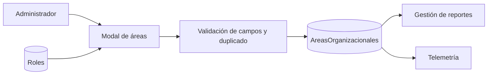

# Componente: Áreas organizacionales

**Selector:** `app-modal-area-organizacional`<br>
**Ubicación:** `src/app/views/analytics/components/modal-area-organizacional`<br>
**Acceso:** Usuarios que gestionan reportes.

---

## ¿Qué resuelve?

Las áreas ya no son textos escritos en el código. Un administrador puede crear, editar, activar o desactivar áreas como **Finanzas**, **BPO / Marketing** u **Operaciones**, y asociar los roles reales de la plataforma. Una nueva área se incorpora sin desplegar una versión nueva del frontend.

El botón **Áreas organizacionales** está disponible en Gestión de Reportes y en Telemetría. Ambos usan el mismo componente y la misma colección.

---

## Cómo se usa

1. Abrir **Áreas organizacionales**.
2. Escribir un nombre claro y único. La descripción es opcional.
3. Elegir el estado y marcar los roles que la componen.
4. Guardar. La alerta confirma “Área creada” y el modal permanece abierto para continuar administrando.
5. Elegir **Editar** desde la lista inferior para ajustar nombre, estado, descripción o roles.

Las áreas inactivas se conservan para trazabilidad, pero no se ofrecen como categoría nueva ni se usan para clasificar consumo futuro.

---

## Campos protegidos

| Campo | Regla de interfaz | Por qué |
|---|---|---|
| Nombre | Obligatorio, máximo 80 caracteres, espacios normalizados. | Evita registros vacíos o variantes accidentales. |
| Descripción | Opcional, máximo 280 caracteres. | Mantiene la ficha breve y legible. |
| Estado | `ACTIVA` o `INACTIVA`. | Evita valores ambiguos. |
| Roles | Se eligen desde la colección `Roles`; no se escriben libremente. | Mantiene asociaciones válidas. |
| Fechas | Las asigna el sistema. | Conserva auditoría de creación y edición. |

Antes de guardar se compara el nombre normalizado: mayúsculas, tildes y espacios no crean un área distinta. Por ejemplo, `Finanzas`, ` FINANZAS ` y `finánzas` se consideran el mismo nombre.

---

## Colección `AreasOrganizacionales`

| Campo | Tipo | Uso |
|---|---|---|
| `Nombre` | `string` | Nombre visible del área. |
| `NombreNormalizado` | `string` | Clave de comparación contra duplicados. |
| `Descripcion` | `string` opcional | Contexto del grupo. |
| `Estado` | `ACTIVA \| INACTIVA` | Disponibilidad operativa. |
| `Roles` | `string[]` | Roles de la colección `Roles` asociados. |
| `FechaCreacion` | fecha | Auditoría de alta. |
| `FechaActualizacion` | fecha | Último cambio. |

### Índice obligatorio en base de datos

La validación de pantalla mejora la experiencia, pero el índice único protege ante dos administradores guardando al mismo tiempo. Antes de crearlo, revisar duplicados:

```javascript
use LogighoDB

db.AreasOrganizacionales.aggregate([
  { $group: { _id: '$NombreNormalizado', total: { $sum: 1 }, nombres: { $push: '$Nombre' } } },
  { $match: { _id: { $ne: null }, total: { $gt: 1 } } }
])

db.AreasOrganizacionales.createIndex(
  { NombreNormalizado: 1 },
  { name: 'nombre_normalizado_unico', unique: true }
)
```

> Estas instrucciones las ejecuta el responsable de base de datos. No se deben ejecutar si la consulta previa devuelve duplicados.

---

## Relación con reportes y telemetría

- En Gestión de Reportes, las categorías disponibles se leen de las áreas **activas**; no hay catálogo hardcodeado.
- En Telemetría, el área se deriva de los roles del usuario al iniciar la sesión. Si no hay coincidencia, se registra `Sin clasificar` como respaldo.
- La sesión guarda su área como fotografía histórica. Editar un área hoy no modifica los eventos antiguos, permitiendo interpretar correctamente cada período.

---

## Servicios y flujo

| Servicio | Acción |
|---|---|
| `AreasOrganizacionalesService.listar()` | Consulta la colección y conserva caché breve para no repetir carga. |
| `crear()` | Valida, normaliza e inserta el área. |
| `actualizar()` | Actualiza campos editables sin cambiar la identidad del registro. |
| `derivarPorRoles()` | Encuentra el área activa que corresponde a los roles de un usuario. |



---

## Historial de cambios

| Fecha | Autor | Cambio |
|---|---|---|
| 2026-09-21 | Iker Acevedo Vargas | Se reemplazó el catálogo hardcodeado por áreas configurables, con edición, prevención de duplicados y asociación dinámica de roles. |
