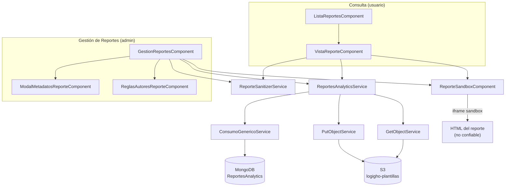
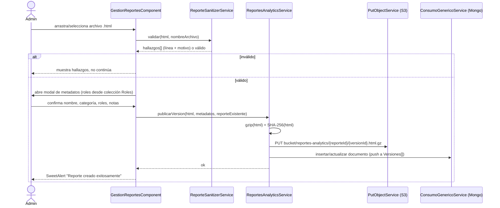
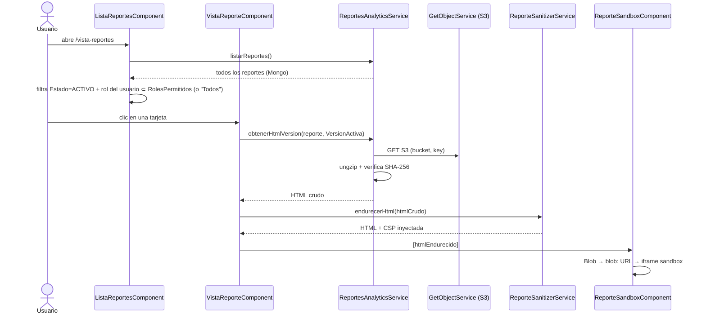

# Módulo: Analytics — Reportes ETL

**Ubicación:** `src/app/views/analytics`
**Acceso:** Autenticado (`AuthGuard`) — administración restringida por rol en UI

---

## ¿Qué hace?

Espacio para que el área de datos publique reportes HTML autocontenidos (dashboards ETL exportados con datos y JavaScript embebidos) y la plataforma los renderice de forma aislada, sin que ese HTML —no controlado por el equipo de desarrollo— pueda comprometer la sesión del usuario ni la API de LogiGho.

Dos perfiles, tres páginas:

| Página | Ruta | Para quién |
| --- | --- | --- |
| Gestión de Reportes | `/app/analytics/gestion-reportes` | Roles `Jefe Datos` / `Desarrollador` (botón visible solo para ellos) |
| Lista de Reportes | `/app/analytics/vista-reportes` | Cualquier usuario autenticado con acceso al reporte |
| Visor de Reporte | `/app/analytics/vista-reportes/:id` | Cualquier usuario autenticado con acceso al reporte |

---

## Por qué existe

Antes de este módulo, los reportes ETL del área de datos se compartían por fuera de la plataforma (archivo suelto, enlace externo). El requisito era traerlos adentro sin renunciar a que el área de datos siga escribiendo JavaScript libremente dentro de su reporte — la tensión central de todo el diseño.

---

## Arquitectura de carpetas

```
views/analytics/
├── routes.ts
├── models/                          # compartido por las 3 páginas
│   └── reporte-analytics.model.ts
├── services/                        # compartido por las 3 páginas
│   ├── reportes-analytics.service.ts    CRUD Mongo + gzip + S3 + integridad
│   ├── reporte-sanitizer.service.ts     Capa 2 (CSP) + Capa 3 (validación)
│   ├── formato.util.ts                  fechas/tamaños, funciones puras
│   └── roles.util.ts                    lectura de rol de sesión, funciones puras
├── components/
│   └── reporte-sandbox/             Capa 1 (iframe sandbox) + Capa 5 (fullscreen)
├── gestion-reportes/                 página admin
│   └── components/
│       ├── modal-metadatos-reporte/     formulario de publicación/edición
│       └── reglas-autores-reporte/      modal con las reglas de validación
├── lista-reportes/                   página usuario (filtra por rol)
└── vista-reporte/                    página visor (:id)
```

**Regla de organización de la sección:** algo vive dentro de la página que lo usa hasta que una **segunda** página de la sección lo necesita — ahí sube a `views/analytics/{models,services,components}`. Solo sale de la sección el día que otra sección de `views/` lo necesite de verdad (nunca se promueve "por si acaso"). Por esto `formato.util.ts` y `roles.util.ts` viven en `services/`: nacieron en una sola página y subieron cuando una segunda los necesitó.

---

## Diagrama de componentes



---

## Modelo de seguridad

El riesgo real: el HTML que sube el área de datos trae JavaScript ejecutable. Si ese script llegara a leer `sessionStorage.id_token` / `headersecurity`, tendría acceso pleno a la API de LogiGho. Cinco capas, de más a menos determinante:

| # | Capa | Dónde vive | Qué evita |
| --- | --- | --- | --- |
| 1 | `<iframe sandbox="allow-scripts allow-downloads allow-modals">` **sin** `allow-same-origin` | `reporte-sandbox.component.html` | Origen opaco: el reporte no puede leer `sessionStorage`, cookies ni el DOM del host. `allow-scripts` + `allow-same-origin` juntos anulan el sandbox — nunca van juntos. |
| 2 | CSP inyectada en el `<head>` del reporte (`connect-src 'none'`, `default-src 'none'`, …) | `ReporteSanitizerService.endurecerHtml()` | Egreso de red: aunque el script se ejecute, `fetch`/XHR/WebSocket no tienen a dónde ir. |
| 3 | Validación en la subida (patrones prohibidos con línea y motivo) | `ReporteSanitizerService.validar()` | No es la defensa real (1 y 2 ya bloquean todo) — da feedback inmediato al autor en vez de que descubra el problema en producción. |
| 4 | Key de S3 con UUID + hash SHA-256 verificado en cada lectura | `ReportesAnalyticsService` | Que el nombre del archivo filtre a la key, y que un objeto alterado en S3 por fuera de la plataforma se sirva sin avisar. |
| 5 | Pantalla completa vía `Element.requestFullscreen()`, nunca pestaña/ventana nueva con el `blob:` | `reporte-sandbox.component.ts` | Un `blob:` abierto como documento de primer nivel hereda el origen de la app — expondría `sessionStorage` igual que si no existiera el sandbox. |

> El atributo `sandbox` del iframe es texto **estático** en la plantilla, nunca `[sandbox]="variable"`: Angular lo exige así cuando el `<iframe>` también usa `[src]` dinámico — con un binding, el valor podría variar en runtime y colar `allow-same-origin`.

### Decisión descartada: abrir en pestaña nueva

Se intentó (y se retiró) un botón "Abrir en pestaña nueva" apuntando a la misma ruta de Angular. Falló porque `rel="noopener"` — necesario para no exponer `window.opener` — **también** corta la copia de `sessionStorage` que el navegador hace a una pestaña nueva del mismo origen; la pestaña nueva arrancaba sin `id_token` y `AuthGuard` la mandaba a login. Se reemplazó por Fullscreen API nativa sobre el mismo iframe: cero navegación, cero problema de sesión, mismo resultado visual.

### Limitación conocida (fuera del alcance del módulo)

El backend (`ApiLambdaCrudGenericoAOT`, `ApiLambdaPutObjectAOT`) no valida roles — cualquier usuario autenticado podría escribir en la colección `ReportesAnalytics` o en el bucket por fuera de la UI. "Solo el admin publica" es hoy una restricción de interfaz, igual que en el resto de la plataforma. Cerrarlo requiere un Lambda Authorizer en API Gateway.

---

## Almacenamiento

- **Mongo:** colección `ReportesAnalytics`, vía `metodoGenerico?coleccion=ReportesAnalytics` (mismo lambda genérico `ApiLambdaCrudGenericoAOT` que usa el resto de la plataforma).
- **S3:** bucket definido en una sola constante (`BUCKET_REPORTES` en `reportes-analytics.service.ts`) — hoy `logigho-plantillas` con prefijo `reportes-analytics/`, temporal hasta que exista un bucket dedicado. Cambiar el bucket definitivo es editar esa constante; las keys ya guardadas en Mongo no cambian de forma.
- **Transporte:** el HTML se gzipea en cliente (`pako`) antes de subir vía `ApiLambdaPutObjectAOT` — el backend tiene un límite duro de payload de 6.291.556 bytes; HTML comprime ~10:1.
- **Versionado real:** cada subida agrega a `Versiones[]` y mueve `VersionActiva`; ninguna key de S3 se sobrescribe ni se borra — el rollback es solo cambiar qué versión está activa.





---

## Decisiones y trade-offs

| Decisión | Alternativa descartada | Por qué |
| --- | --- | --- |
| Bucket S3 compartido (`logigho-plantillas` + prefijo) | Bucket dedicado desde el día uno | Arrancar sin depender de aprovisionar infraestructura nueva; migrar es cambiar una constante |
| Reglas de validación en código, no en Mongo | Colección de reglas configurable | Son lógica de seguridad — un cambio ahí debe pasar por PR, no por un `PUT` a la API |
| Categorías como constante sugerida en el modal | Colección `CategoriasReportesAnalytics` | Solo esta sección las usa, sin permisos ni campos extra — se promueve el día que un segundo consumidor o campos adicionales (ícono, color) lo justifiquen |
| Fullscreen API nativa en vez de pestaña nueva | `window.open()` a la misma ruta | Evita el problema real de pérdida de sesión por `noopener` (ver arriba) |
| Menú de acciones "⋮" con `position: fixed` calculado en TS | `position: absolute` anclado a la fila | La tabla tiene `overflow-x: auto`, que recorta cualquier elemento absoluto que se salga de su alto |

---

## Historial de cambios

| Fecha | Autor | Cambio |
| --- | --- | --- |
| 2026-08-14 | Iker Acevedo Vargas | Versión inicial del módulo: gestión, lista y visor de reportes, sandbox de seguridad de 5 capas, roles dinámicos desde Mongo |
