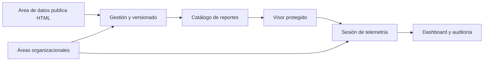

# Módulo: Analytics — Reportes ETL

**Ubicación:** `src/app/views/analytics`<br>
**Acceso:** sesión autenticada; Telemetría tiene guardia adicional por rol.

---

## ¿Qué hace?

Analytics reúne el ciclo completo de los reportes HTML/BI de LogiGho: el área de datos los publica y versiona; el resto de la organización los encuentra y consume; y los responsables autorizados pueden entender su uso mediante telemetría.

| Vista | Ruta | Para quién |
|---|---|---|
| Gestión de Reportes | `/app/analytics/gestion-reportes` | Personas que administran y publican reportes. |
| Lista de Reportes | `/app/analytics/vista-reportes` | Usuarios autenticados con acceso al reporte. |
| Visor de Reporte | `/app/analytics/vista-reportes/:id` | Usuarios que consultan un reporte específico. |
| Telemetría y Auditoría | `/app/analytics/telemetria` | `CEO`, `Jefe Datos` y `Desarrollador`. |

---

## Recorrido sencillo



1. Un administrador sube un reporte HTML y define sus datos, estado y roles autorizados.
2. El reporte aparece como tarjeta a los usuarios con acceso en la interfaz.
3. El visor lo carga dentro de un contenedor seguro, permite cambiar versiones y descargar el HTML original.
4. El uso visible del visor alimenta métricas y auditoría.
5. Las áreas organizacionales agrupan roles configurables y evitan categorías escritas en código.

---

## Estructura de carpetas

```text
views/analytics/
├── routes.ts
├── guards/telemetria.guard.ts
├── models/
├── components/
│   ├── reporte-sandbox/
│   └── modal-area-organizacional/
├── gestion-reportes/
├── lista-reportes/
├── vista-reporte/
├── telemetria-reportes/
└── services/
    ├── reportes-analytics/
    ├── reporte-sanitizer/
    ├── areas-organizacionales/
    ├── telemetria-tracker/
    └── telemetria-consulta/
```

La regla es simple: un elemento se mantiene cerca de la vista que lo usa; cuando una segunda vista lo necesita, se convierte en componente, modelo o servicio compartido de `analytics`.

---

## Áreas y roles

Las categorías de reportes y áreas de consumo ya no son una lista fija. La colección `AreasOrganizacionales` administra nombre, estado, descripción y roles. Gestión de Reportes, Lista de Reportes y Telemetría usan esta fuente común.

Consulta la guía completa en [Áreas organizacionales](areas-organizacionales.md).

---

## Seguridad del visor

Un reporte HTML puede contener JavaScript, por lo que nunca se inserta directamente en el DOM de LogiGho. El visor aplica varias barreras complementarias:

| Capa | Protección |
|---|---|
| Iframe sandbox | Ejecuta el reporte en un origen aislado, sin acceso a sesión ni DOM de la plataforma. |
| CSP inyectada | Impide conexiones de red no autorizadas desde el reporte. |
| Validación al publicar | Explica al autor archivos o patrones no permitidos antes de subirlos. |
| Hash SHA-256 | Detecta alteraciones del archivo almacenado. |
| Fullscreen nativo | Muestra el mismo iframe, no abre un `blob:` como página independiente. |

La combinación `allow-scripts` + `allow-same-origin` no se utiliza nunca: anularía el aislamiento del sandbox.

---

## Datos y almacenamiento

| Recurso | Uso |
|---|---|
| `ReportesAnalytics` | Metadatos, estado, roles permitidos y versiones. |
| S3 `logigho-plantillas/reportes-analytics/` | HTML comprimido de cada versión. |
| `AreasOrganizacionales` | Áreas configurables y sus roles. |
| `SesionesReportesAnalytics` | Sesiones y eventos de consumo. |
| `Roles` | Catálogo oficial de roles. |

Las versiones son inmutables: publicar un archivo agrega una versión; editar nombre, área, estado o roles no crea una versión ni reemplaza el archivo en S3.

---

## Límites conocidos y siguiente paso

- La interfaz controla visibilidad y acciones por rol, pero la autorización definitiva debe reforzarse también en backend/API Gateway antes de abrir los endpoints a consumidores no confiables.
- La vista directa del reporte debe reforzar en backend la verificación de `RolesPermitidos`, además del filtro de catálogo; no se debe confiar únicamente en la UI para proteger datos.
- El histórico de telemetría se puede consultar con **Todo**, pero para operación diaria se recomiendan períodos acotados y los índices de [Telemetría](telemetria-reportes.md).

---

## Historial de cambios

| Fecha | Autor | Cambio |
|---|---|---|
| 2026-08-14 | Iker Acevedo Vargas | Versión inicial de gestión, catálogo, visor y sandbox. |
| 2026-09-21 | Iker Acevedo Vargas | Rediseño responsive, áreas configurables, telemetría, auditoría, exportación y mejoras de rendimiento. |
