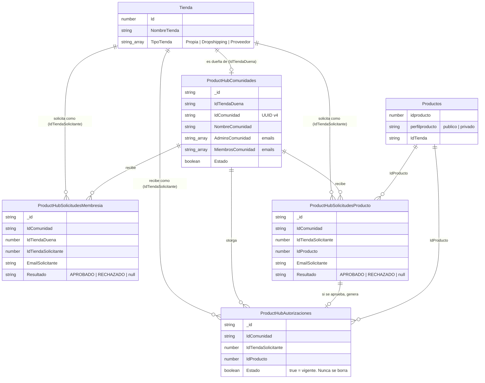

# Entidad-Relación: Product HUB

## Autor: Adalberto González
Fecha creación: 2026-08-19  
Estado: producción  

---

Colecciones propias del módulo, todas en MongoDB. `Productos` y `Tienda` son colecciones core del sistema (no exclusivas de Product HUB), incluidas aquí solo por las relaciones que cruzan hacia ellas.

---

## Notas del modelo

- **`IdComunidad` es un UUID v4**, no el `_id` de Mongo ni un consecutivo — ver `arquitectura/decisiones.md` (ADR-002) y `crearIdComunidad()`. Se usa como clave lógica en las 3 colecciones hijas.
- **`ProductHubComunidades` es 1:1 con la tienda dueña** en la práctica: una tienda solo debería tener una comunidad activa, aunque el esquema no lo restringe a nivel de base de datos.
- **`MiembrosComunidad` guarda emails de usuario**, no ids de tienda. Si dos usuarios distintos comparten la misma tienda asignada, cada uno necesita su propia entrada aprobada — la membresía no se hereda automáticamente entre operadores de la misma tienda.
- **`ProductHubAutorizaciones` nunca se borra.** Solo existe la ruta de creación (`Estado:true` al aprobar una `SolicitudProducto`); no hay UI para revocar (`Estado:false`) hoy.
- **El cruce con `PedidosInter` no es una relación de base de datos formal** — se resuelve en tiempo de consulta (pipeline de agregación) comparando `Productos.idproducto` autorizado contra los 12 campos planos `IdStock1..12` de cada pedido. Ver `gestion-comunidad.md` → `getEstadisticasVentasComunidad`.

---

## Historial de cambios

| Fecha | Autor | Cambio |
|---|---|---|
| 2026-08-19 | Adalberto González | Creación del diagrama, módulo ya en producción |
