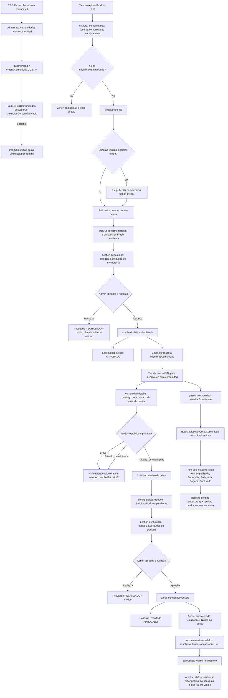

# Diagrama de flujo: Product HUB

```mermaid
flowchart TD
    A[CEO/Desarrollador crea comunidad] --> A1[administrar-comunidades: nueva comunidad]
    A1 --> A2[IdComunidad = crearIdComunidad UUID v4]
    A2 --> A3[ProductHubComunidades: Estado true, MiembrosComunidad vacio]
    A3 -->|opcional| A4[crea Comunidad social vinculada por admins]

    B[Tienda explora Product HUB] --> B1[explorar-comunidades: feed de comunidades ajenas activas]
    B1 --> C{Ya es miembro/admin/dueña?}
    C -->|Si| D[Ver en comunidad-detalle directo]
    C -->|No| E[Solicitar unirme]
    E --> F{Cuantas tiendas elegibles tengo?}
    F -->|1| G[Solicitud a nombre de esa tienda]
    F -->|2+| H[Elegir tienda en seleccion-tienda-modal]
    H --> G
    G --> I[crearSolicitudMembresia: SolicitudMembresia pendiente]

    I --> J[gestion-comunidad: bandeja Solicitudes de membresia]
    J --> K{Admin aprueba o rechaza}
    K -->|Rechaza| L[Resultado RECHAZADO + motivo. Puede volver a solicitar]
    K -->|Aprueba| M[aprobarSolicitudMembresia]
    M --> M1[Solicitud Resultado APROBADO]
    M --> M2[Email agregado a MiembrosComunidad]
    M2 --> N[Tienda queda FIJA para siempre en esta comunidad]

    N --> O[comunidad-detalle: catalogo de productos de la tienda duena]
    O --> P{Producto publico o privado?}
    P -->|Publico| Q[Visible para cualquiera, sin relacion con Product HUB]
    P -->|Privado, de mi tienda| Q
    P -->|Privado, de otra tienda| R[Solicitar permiso de venta]
    R --> S[crearSolicitudProducto: SolicitudProducto pendiente]

    S --> T[gestion-comunidad: bandeja Solicitudes de producto]
    T --> U{Admin aprueba o rechaza}
    U -->|Rechaza| V[Resultado RECHAZADO + motivo]
    U -->|Aprueba| W[aprobarSolicitudProducto]
    W --> W1[Solicitud Resultado APROBADO]
    W --> W2[Autorizacion creada: Estado true. Nunca se borra]

    W2 --> X[modal-creacion-pedidos: resolverAutorizacionesProductHub]
    X --> Y[esProductoVisibleParaUsuario]
    Y --> Z[Amplia catalogo visible al crear pedido. Nunca resta lo que ya era visible]

    N --> AA[gestion-comunidad: pestaña Estadisticas]
    AA --> AB[getEstadisticasVentasComunidad sobre PedidosInter]
    AB --> AC[Filtra solo estados venta real: Digitalizada, Entregada, Archivada, Pagada, Facturado]
    AC --> AD[Ranking tiendas autorizadas + ranking productos mas vendidos]
```
