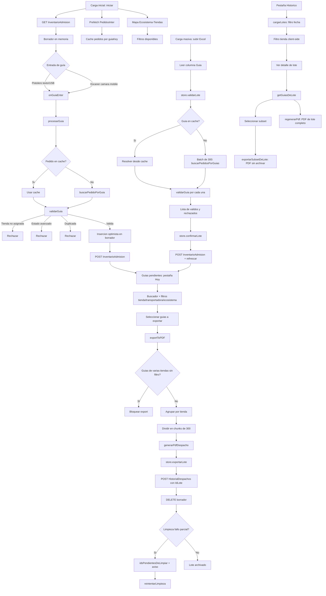

# Diagrama de flujo: Relación de Despacho

```mermaid
flowchart TD
    A[Carga inicial: iniciar] --> A1[GET InventarioAdmision]
    A --> A2[Prefetch PedidosInter]
    A --> A3[Mapa Ecosistema-Tiendas]
    A1 --> B[Borrador en memoria]
    A2 --> C[Cache pedidos por guiaKey]
    A3 --> D[Filtros disponibles]

    B --> E{Entrada de guía}
    E -->|Pistolero texto/USB| F[onGuiaEnter]
    E -->|Escaner camara mobile| F

    F --> G[procesarGuia]
    G --> H{Pedido en cache?}
    H -->|Si| I[Usar cache]
    H -->|No| J[buscarPedidoPorGuia]
    I --> K[validarGuia]
    J --> K
    K -->|Tienda no asignada| K1[Rechazar]
    K -->|Estado avanzado| K2[Rechazar]
    K -->|Duplicada| K3[Rechazar]
    K -->|Valida| L[Insercion optimista en borrador]
    L --> M[POST InventarioAdmision]

    N[Carga masiva: subir Excel] --> O[Leer columna Guia]
    O --> P[store.validarLote]
    P --> Q{Guia en cache?}
    Q -->|Si| R[Resolver desde cache]
    Q -->|No| S[Batch de 300: buscarPedidosPorGuias]
    R --> T[validarGuia por cada una]
    S --> T
    T --> U[Lista de validos y rechazados]
    U --> V[store.confirmarLote]
    V --> W[POST InventarioAdmision + refrescar]

    M --> X[Guias pendientes: pestaña Hoy]
    W --> X

    X --> Y[Buscador + filtros tienda/transportadora/ecosistema]
    Y --> Z[Seleccionar guias a exportar]
    Z --> AA[exportToPDF]
    AA --> AB{Guias de varias tiendas sin filtro?}
    AB -->|Si| AC[Bloquear export]
    AB -->|No| AD[Agrupar por tienda]
    AD --> AE[Dividir en chunks de 300]
    AE --> AF[generarPdfDespacho]
    AF --> AG[store.exportarLote]
    AG --> AH[POST HistorialDespachos con IdLote]
    AH --> AI[DELETE borrador]
    AI --> AJ{Limpieza fallo parcial?}
    AJ -->|Si| AK[idsPendientesDeLimpiar + aviso]
    AK --> AL[reintentarLimpieza]
    AJ -->|No| AM[Lote archivado]

    AN[Pestaña Historico] --> AO[cargarLotes: filtro fecha]
    AO --> AP[Filtro tienda client-side]
    AP --> AQ[Ver detalle de lote]
    AQ --> AR[getGuiasDeLote]
    AR --> AS[Seleccionar subset]
    AS --> AT[exportarSubsetDeLote: PDF sin archivar]
    AR --> AU[regenerarPdf: PDF de lote completo]
```
